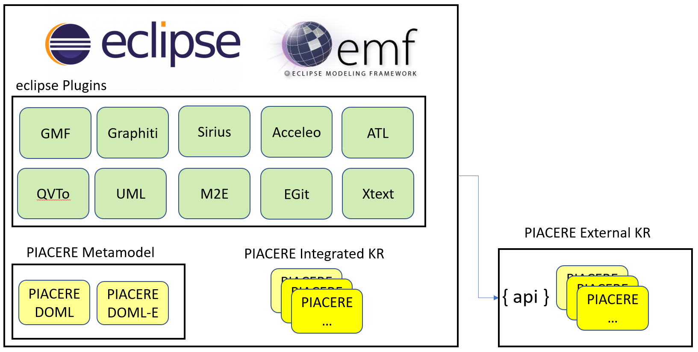
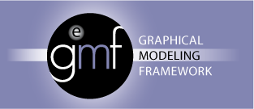
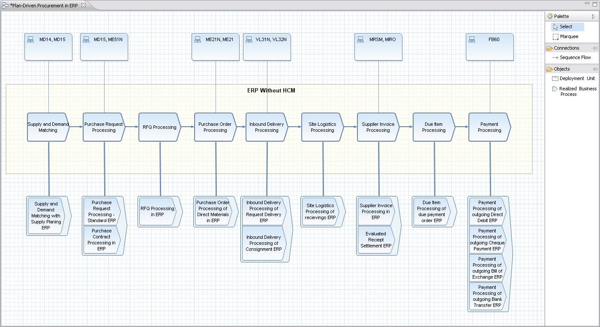
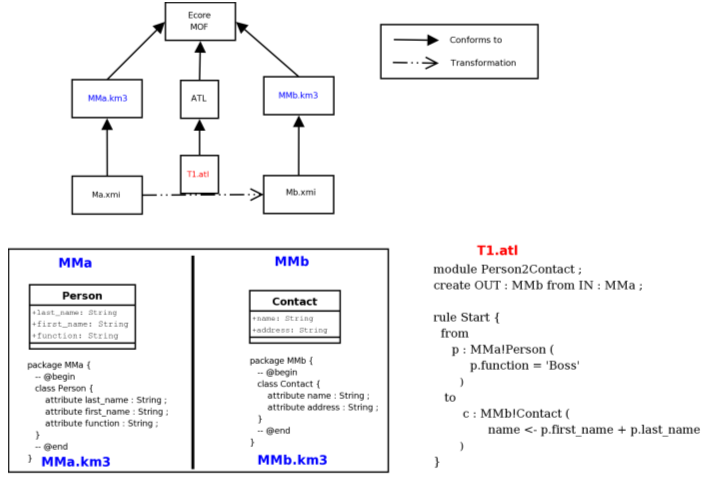
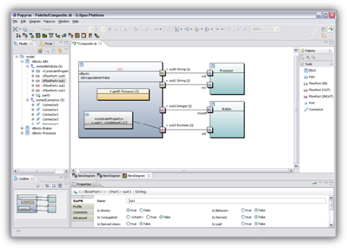

# Piacere IDE Implmementation

## Technical description

The Eclipse IDE is an Eclipse Rich Client Platform (RCP) application. The core functionalities of the Eclipse IDE are provided via plug-ins (components). The PIACERE IDE functionality is based on the concept of extensions and extension points.

To build the IDE some Eclipse modelling plugins should be added. Later, a list of these plugins will be provided with an explanation of the functionality provided by each one. This is only an initial list that could vary during the development of the IDE.
Thanks to EMF, the IDE will support metamodels. In the case of the PIACERE IDE, DOML and DOML-E will be the supported metamodels used for modelling application infrastructures.

### IDE Integration mechanism

The pivotal tool of the project will be the IDE and it will give support to the PIACERE Framework. The other Key Results of the project will be integrated into the IDE using some of the integration mechanism that these technologies provide. The PIACERE IDE will be customized with suitable plug-ins that will integrate the different tools, to minimize the learning curve and simplify adoption of IaC approach. Not all KR/tools will be integrated in the same way. Several integration patterns, focusing on the Eclipse plugin architecture, will be defined. They will allow the implementation and incorporation of application features very quickly.

To integrate the other piacere KR into the IDE, a set of menus will be enabled to facilitate access to these KRs. Some of these tools could be fully integrated into Eclipse and should be developed as Eclipse plugins. On the other hand, other tools could be run in isolation and through a REST API or any other integration mechanism could be invoked remotely. In this case, from the Eclipse menu the tool would be invoked via a REST service.



The IDE will use “Cheat sheets”, which is a built-in mechanism for displaying mini tutorials “Wizards”, to guide users on how to use the different tools. Cheat sheets are quick-and-dirty instructions for how to perform multi-step processes in Eclipse, displayed on the side of the workbench where you can quickly and easily step through them. 

## Components description

This section lists some modelling plugins that could be interesting for building the Piacere IDE.

### Eclipse base

These plugins are the core of Eclipse  and involve the minimum plugin set to build an executable desktop application.

```{admonition} Current version
:class: tip
The current version of these plugins is 4.21.
```

### GMF Runtime



Graphical Modelling Framework is the most used library to develop graphical editors on Eclipse. It is based on EMF models, and generates EMF based models too.
```{admonition} Current version
:class: tip
The current version of GMF is >= 1.9.0.
```

### Graphiti

Graphiti is another library for developing graphical editors on Eclipse, which enables rapid development of state-of-the-art diagram editors for domain models
```{admonition} Current version
:class: tip
The current version of Graphiti is 0.12.0.
```



### Sirius


Sirius is a tool based on EMF and GMF that allows to easily create graphical modelling workbenches. A modelling workbench created with Sirius is composed of a set of Eclipse editors (diagrams, tables, and trees) which allow the users to create, edit and visualize EMF models.
```{admonition} Current version
:class: tip
The current version of Sirius is 6.5.1.
```

### Acceleo

Acceleo is a template-based technology to create code generators from an EMF model, which has been designed to be customizable, interoperable, and easy to kick-start.
```{admonition} Current version
:class: tip
The current version of Acceleo is 3.7.
```


### ATL

ATL is a model transformation-oriented language that helps to convert a model defined in a Domain Specific Language (DSL) into another model defined in a distinct (or not) DSL. These include some sample ATL transformations, an ATL transformation engine, and an IDE for ATL.
```{admonition} Current version
:class: tip
The current version of ATL is 4.5.0.
```



### QVTo

QVTO is another language that provides features to implement transformations between models. Eclipse QVTo is the only actively maintained QVTo implementation, and so conversely, QVT 1.2 has evolved to resolve issues uncovered by Eclipse QVTo and its users.
```{admonition} Current version
:class: tip
The current version of QVTo is 3.10.5.
```

### UML2

Eclipse UML2 is a set of plugins based on EMF that brings support to UML OMG Metamodel in Eclipse. Although UML2 provides the metamodel, it does not provide UML modelling tools itself. It is the base of other important projects like Papyrus, which incorporates these kinds of tools.
```{admonition} Current version
:class: tip
The current version of UML2 is 5.5.2.
```

### M2E

The M2Eclipse, or M2E plugin provides Apache Maven functionality into Eclipse. It allows building projects based on Maven within Eclipse, as well as integrated dependency management and other features.
```{admonition} Current version
:class: tip
The current version of M2E is 1.19.0.
```

### Papyrus

Papyrus is the most popular open-source environment for editing UML models based on EMF for Eclipse. It provides many editors such as the Class diagram editor, Activity diagram editor, State Machine diagram editor, Components diagram editor, Profile diagram editor, etc.
```{admonition} Current version
:class: tip
The current version of Papyrus is 5.2.0.
```



### EGit

EGit is a set of plugins that enables to connect to GIT source code repositories.
```{admonition} Current version
:class: tip
The current version of EGit is 5.13.0.
```


### Xtext
Xtext is a framework for development of programming languages and domain-specific languages. With Xtext you define your language using a powerful grammar language. As a result, you get a full infrastructure, including parser, linker, type checker, compiler as well as editing support for Eclipse, any editor that supports the Language Server Protocol and your favourite web browser
```{admonition} Current version
:class: tip
The current version of Xtext is 2.25.0.
```


