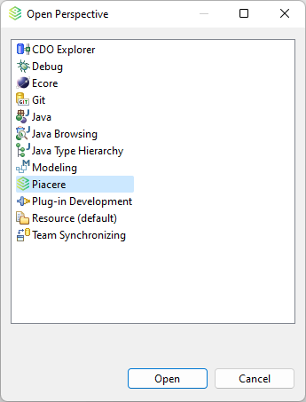
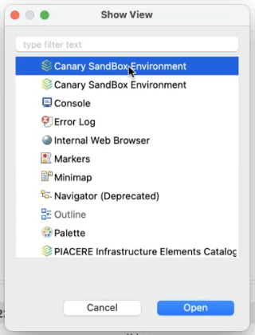
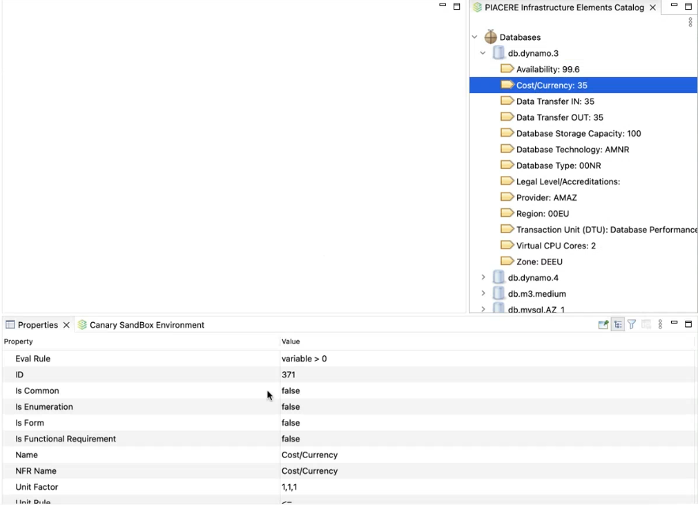

# User Manual

## Requeriments

**Minimum Requeriments:** Java JRE 11+.

## First look and Set Up

When the PIACERE IDE opens, you can see this window.

In this window, we can see the PIACERE menu embedded in the eclipse toolbar. Furthermore, this IDE have a custom view for PIACERE modelling. We can open this perspective by click in the table icon located in the top right part of the window:

The next step to setting-up the environment, is to configure the tool’s endpoint. To do this we need to make click on the window menu located in the toolbar and then click on Preferences option.

In the PIACERE menu we can find some options to configure the different tools.

You can choose some tool by clicking on the desired tool.

We can configure host, port, and protocol for each tool. However, for security inspector, we can configure more parameters than in the rest (Enabled, Configured and Entity Type).
When you finish all configurations, you are ready to make the first PIACERE project.
If you open the PIACERE view, you can create a PIACERE project by clicking in the new project’s button. Moreover, we add some shortcuts to create some usual files like DOML file.

## IDE usage

### Model files

You can convert doml files to domlx and domlx to doml using the pop-up menu. If you click with secondary button in doml file, you can see the “Generate DOMLX Model” in PIACERE submenu and if you do the same in domlx file you can see the “Generate DOML Model” in PIACERE submenu.
The sequence to make doml or domlx conversion is:

Name this new file and select “OK”.

The following message box will appear.

A new file will appear in the Project Explorer.

DOML only can be open as text, but DOMLX can be open as tree.

For open the domlx as tree, you need to click on the file with the secondary button and select open with. Now select infrastructure model editor option.

Now you can see the model as tree.

### Optimization (KR9)

Secondary button in the .doml file and select “PIACERE” and “Optimize DOML”.

Then, a new message appears.

It is possible save the optimization result on the workspace:

### Validation (KR5)

Also, you can validate the DOML It is possible to generate a .dml file if you have a .dmlx file. Click secondary button and select “PIACERE”, “Generate DOML Model”.

When you save the model validation, a new file is generated in the project that contains the result of the validation: satisfactory or unsatisfactory.

### Code Generator (KR3)

This is used by the same submenu as validation.

If the user has previously generated IaC files, they can be selected for the code generator to take them into account in the generation of the IaC.

When the IaC Code Generator finish, appears a new file with .zip extension. In this file we can see the terraform and the ansible configuration.

### Security scan (KR6 & KR7)
To this kind of files, you can run a “Perform Security Scan”. Previously to make use of these tools it is necessary to click on the project and create a new IaC project.

Once the new project is created, a file with extension .iac is generated. The analysis can be run on this file using the right button.

A new screen appears with all the possible scans to perform, select the desired ones and launch the scan.

When the process is finished you can check the scan:

### Canary Sandbox Environment (KR8)

For using canary sandbox or catalogue, first we need to open the correct view. To do this, we can use the window toolbar menu and click on show view option.

In this window you can see all deployments that are currently available. You can add more deployments, or download the current deploy.

Download this information at project desktop.

Visualize the file info is easy with “Text Editor”.

A .json file that describes a canary, like this example.

Using this json configuration we can add the deployment to the canary sandbox environment.

### Infrastructure Elements Catalogue

When you open the infrasctructure elemeents catalogue, you can see a tab with all items of the Catalogue.

For each of these elements you can show all their properties only with a click.

### Runtime Controller (KR11 & KR12)

In this view you can create a new deployment using the option “Create Deployment”.

You only need a valid URL of a repository

Once it is created you can get more information with secondary button “Get Deployment Details”.

Another option of this view is for launch the Grafana module to control the performance of the deployment.

You need to fill the username and password to use it.

